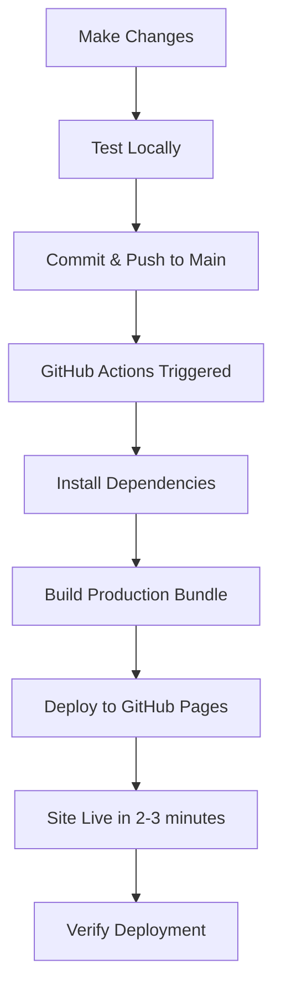

# Deployment Guide

Complete guide to deploying the Wedding Website to GitHub Pages and other hosting platforms.

## Table of Contents

- [Quick Start](#quick-start)
- [GitHub Pages Deployment](#github-pages-deployment)
- [Alternative Hosting Options](#alternative-hosting-options)
- [Configuration Details](#configuration-details)
- [Troubleshooting](#troubleshooting)
- [Custom Domain Setup](#custom-domain-setup)

---

## Quick Start

**TL;DR:** Merge your changes to the `main` branch, and the site automatically deploys to:
```
https://bradyudovich.github.io/Wedding-Website/
```

---

## GitHub Pages Deployment

### Initial Setup (One-Time)

1. **Enable GitHub Pages**:
   - Navigate to your repository on GitHub
   - Go to **Settings** > **Pages** (left sidebar)
   - Under **Build and deployment** > **Source**:
     - Select **"GitHub Actions"** from dropdown
     - ⚠️ Do NOT use "Deploy from a branch" (legacy method)
   - Click **Save**

2. **Verify Workflow Permissions**:
   - Go to **Settings** > **Actions** > **General**
   - Scroll to **Workflow permissions**
   - Select **"Read and write permissions"**
   - Check **"Allow GitHub Actions to create and approve pull requests"**
   - Click **Save**

### Deploying Changes

#### Method 1: Push to Main Branch (Automatic)

```bash
# Ensure you're on main branch
git checkout main

# Pull latest changes
git pull origin main

# Merge your feature branch
git merge your-feature-branch

# Push to trigger deployment
git push origin main
```

The GitHub Actions workflow will automatically:
1. Install dependencies
2. Build the production bundle
3. Deploy to GitHub Pages
4. Complete in ~2-3 minutes

**Monitor Progress:**
- Go to **Actions** tab in GitHub
- Click on the latest "Deploy to GitHub Pages" workflow
- Watch the build and deploy jobs complete
- Green checkmark ✓ = Deployment successful!

#### Method 2: Manual Trigger

You can manually trigger deployment without pushing code:

1. Go to **Actions** tab in your GitHub repository
2. Select **"Deploy to GitHub Pages"** from the workflow list
3. Click the **"Run workflow"** dropdown button
4. Select branch: `main`
5. Click **"Run workflow"** button

Use this when:
- You want to redeploy without code changes
- Previous deployment failed and you fixed the issue
- Testing the deployment pipeline

### Workflow File Explained

Location: `.github/workflows/deploy.yml`

```yaml
name: Deploy to GitHub Pages

on:
  push:
    branches:
      - main          # Triggers on push to main
  workflow_dispatch:  # Enables manual triggering

permissions:
  contents: read      # Read repository content
  pages: write        # Write to GitHub Pages
  id-token: write     # Write ID token for deployment

jobs:
  build:
    runs-on: ubuntu-latest
    steps:
      - name: Checkout code
        uses: actions/checkout@v4
      
      - name: Setup Node.js
        uses: actions/setup-node@v4
        with:
          node-version: '20'
          cache: 'npm'    # Caches node_modules for faster builds
      
      - name: Install dependencies
        run: npm ci       # Clean install (faster than npm install)
      
      - name: Build the app
        run: npm run build
      
      - name: Upload artifact
        uses: actions/upload-pages-artifact@v3
        with:
          path: ./dist    # Vite outputs to dist/

  deploy:
    environment:
      name: github-pages
      url: ${{ steps.deployment.outputs.page_url }}
    runs-on: ubuntu-latest
    needs: build          # Waits for build job to complete
    steps:
      - name: Deploy to GitHub Pages
        id: deployment
        uses: actions/deploy-pages@v4
```

---

## Alternative Hosting Options

### Netlify

1. **Install Netlify CLI**:
   ```bash
   npm install -g netlify-cli
   ```

2. **Build and Deploy**:
   ```bash
   npm run build
   netlify deploy --prod --dir=dist
   ```

3. **Or use Drag & Drop**:
   - Go to [Netlify Drop](https://app.netlify.com/drop)
   - Drag the `dist` folder
   - Get instant URL

**Configuration** (`netlify.toml`):
```toml
[build]
  command = "npm run build"
  publish = "dist"

[[redirects]]
  from = "/*"
  to = "/index.html"
  status = 200
```

### Vercel

1. **Install Vercel CLI**:
   ```bash
   npm install -g vercel
   ```

2. **Deploy**:
   ```bash
   vercel --prod
   ```

**Configuration** (`vercel.json`):
```json
{
  "buildCommand": "npm run build",
  "outputDirectory": "dist",
  "rewrites": [
    {
      "source": "/(.*)",
      "destination": "/index.html"
    }
  ]
}
```

### Surge

Simple static hosting:

```bash
# Install surge
npm install -g surge

# Build and deploy
npm run build
surge dist your-custom-name.surge.sh
```

### Firebase Hosting

1. **Install Firebase CLI**:
   ```bash
   npm install -g firebase-tools
   firebase login
   ```

2. **Initialize**:
   ```bash
   firebase init hosting
   # Select "dist" as public directory
   # Configure as single-page app: Yes
   ```

3. **Deploy**:
   ```bash
   npm run build
   firebase deploy --only hosting
   ```

---

## Configuration Details

### Base Path Configuration

The project is configured for GitHub Pages project site (username.github.io/Wedding-Website):

**`vite.config.js`**:
```javascript
export default defineConfig({
  plugins: [react()],
  base: '/Wedding-Website/',  // Must match repo name
})
```

**`src/App.jsx`**:
```javascript
<Router basename="/Wedding-Website">
  {/* Routes */}
</Router>
```

**`public/404.html`**:
```javascript
var pathSegmentsToKeep = 1;  // 1 for project pages, 0 for user/org pages
```

### SPA Routing on GitHub Pages

GitHub Pages doesn't natively support Single Page Applications (SPAs). The project includes a solution:

1. **`public/404.html`**: Catches 404 errors and redirects to index.html with the path as a query parameter
2. **`index.html`**: Script reads the query parameter and restores the original URL
3. **React Router**: Takes over and renders the correct page

This allows direct navigation and page refreshes to work correctly on all routes.

---

## Troubleshooting

### Deployment Fails in GitHub Actions

**Error: "npm ci" fails**

```bash
# Locally regenerate package-lock.json
rm package-lock.json
npm install
git add package-lock.json
git commit -m "Regenerate package-lock.json"
git push
```

**Error: "Permission denied to deploy"**

1. Go to **Settings** > **Actions** > **General**
2. Under **Workflow permissions**, select **"Read and write permissions"**
3. Click **Save**

**Error: "Page build failed"**

- Ensure GitHub Pages source is set to "GitHub Actions" not "Deploy from a branch"
- Check that `dist` folder is being generated (run `npm run build` locally)

### Website Shows Blank Page

**After deployment, page is blank:**

1. **Check browser console** (F12 → Console tab):
   - Look for 404 errors on JavaScript/CSS files
   - Check if base path is correct

2. **Verify base path**:
   ```javascript
   // vite.config.js - should match your repo name
   base: '/Wedding-Website/',
   ```

3. **Clear cache**:
   - Chrome: Ctrl+Shift+R (Windows) or Cmd+Shift+R (Mac)
   - Or open in incognito/private mode

4. **Check deployment status**:
   - Go to **Actions** tab
   - Verify workflow completed successfully (green checkmark)
   - Wait 2-3 minutes after deployment

### Routes Don't Work (404 Errors)

**Symptom**: Homepage works, but `/travel` or `/faq` shows 404

**Solution**: Verify these files exist:

1. `public/404.html` exists and contains redirect script
2. `index.html` contains the redirect handler script
3. `App.jsx` has correct basename in BrowserRouter

**Quick Fix**:
```bash
# Rebuild to ensure 404.html is copied
npm run build

# Check if 404.html exists in dist
ls dist/404.html

# If missing, check public folder
ls public/404.html
```

### Links Don't Work Correctly

**Symptom**: Clicking navigation links leads to wrong paths

**Check**:
1. All `<Link>` components use relative paths: `to="/travel"` not `to="/Wedding-Website/travel"`
2. Router has correct basename: `<Router basename="/Wedding-Website">`
3. Vite config has correct base: `base: '/Wedding-Website/'`

### Images or Assets Not Loading

**Symptom**: Broken image icons or missing CSS

**Solution**:
- Use relative paths in imports: `import logo from './assets/logo.png'`
- Use public folder for static assets: ``
- Or reference with base URL: `${import.meta.env.BASE_URL}assets/image.png`

### Local Build Works, Deployment Doesn't

**Common causes**:

1. **Environment differences**:
   ```bash
   # Test with production build locally
   npm run build
   npm run preview
   # Visit http://localhost:4173/Wedding-Website/
   ```

2. **Case-sensitive file names**:
   - Linux (GitHub Actions) is case-sensitive
   - Windows/Mac are case-insensitive
   - Ensure imports match exact filename case

3. **Missing dependencies**:
   ```bash
   # Ensure all deps are in package.json
   npm install --save any-missing-package
   ```

---

## Custom Domain Setup

### Using Your Own Domain

If you want to use `www.yourwedding.com` instead of `bradyudovich.github.io/Wedding-Website`:

#### Step 1: Add Domain in GitHub

1. Go to **Settings** > **Pages**
2. Under **Custom domain**, enter your domain: `www.yourwedding.com`
3. Click **Save**
4. GitHub creates a `CNAME` file in your repo

#### Step 2: Update Code Configuration

**`vite.config.js`**:
```javascript
export default defineConfig({
  plugins: [react()],
  base: '/',  // Change from '/Wedding-Website/' to '/'
})
```

**`src/App.jsx`**:
```javascript
<Router basename="/">  {/* Change from "/Wedding-Website" to "/" */}
  {/* Routes */}
</Router>
```

**`public/404.html`**:
```javascript
var pathSegmentsToKeep = 0;  // Change from 1 to 0
```

#### Step 3: Configure DNS

Add DNS records with your domain registrar:

**For apex domain** (`yourwedding.com`):
```
Type: A
Name: @
Value: 185.199.108.153
       185.199.109.153
       185.199.110.153
       185.199.111.153
```

**For www subdomain** (`www.yourwedding.com`):
```
Type: CNAME
Name: www
Value: bradyudovich.github.io
```

**For both**:
```bash
# Apex domain (example.com)
A    @    185.199.108.153
A    @    185.199.109.153
A    @    185.199.110.153
A    @    185.199.111.153

# WWW subdomain
CNAME www  bradyudovich.github.io
```

#### Step 4: Enable HTTPS

1. In **Settings** > **Pages**
2. Check **"Enforce HTTPS"**
3. Wait for SSL certificate provisioning (can take up to 24 hours)

#### Step 5: Rebuild and Deploy

```bash
git add .
git commit -m "Configure for custom domain"
git push origin main
```

### DNS Propagation

- DNS changes can take 24-48 hours to propagate globally
- Use [DNS Checker](https://dnschecker.org) to verify
- Test with `dig` or `nslookup`:
  ```bash
  dig yourwedding.com
  nslookup www.yourwedding.com
  ```

---

## Pre-Deployment Checklist

Before deploying to production, verify:

- [ ] **Build succeeds locally**: `npm run build`
- [ ] **Preview works locally**: `npm run preview`
- [ ] **All routes accessible**: /, /travel, /faq
- [ ] **Language toggle works**: EN ↔ ES
- [ ] **RSVP button links correctly**
- [ ] **Mobile responsive**: Test on phone or use browser dev tools
- [ ] **Cross-browser testing**: Chrome, Firefox, Safari, Edge
- [ ] **Content is up-to-date**: Check `src/translations.js`
- [ ] **No console errors**: Check browser console (F12)
- [ ] **Images load**: All images and assets display
- [ ] **Links work**: All internal and external links function
- [ ] **GitHub Actions succeeds**: Workflow completes without errors

---

## Deployment Workflow Summary



---

## Additional Resources

- [GitHub Pages Documentation](https://docs.github.com/en/pages)
- [Vite Deployment Guide](https://vitejs.dev/guide/static-deploy.html#github-pages)
- [React Router on GitHub Pages](https://github.com/rafgraph/spa-github-pages)
- [Custom Domain Guide](https://docs.github.com/en/pages/configuring-a-custom-domain-for-your-github-pages-site)

---

## Support

If you encounter issues not covered in this guide:

1. Check the [GitHub Actions logs](https://github.com/bradyudovich/Wedding-Website/actions)
2. Review browser console for errors (F12)
3. Compare your configuration with this guide
4. Test locally with `npm run preview` to isolate deployment issues

---

**Last Updated**: February 2026
